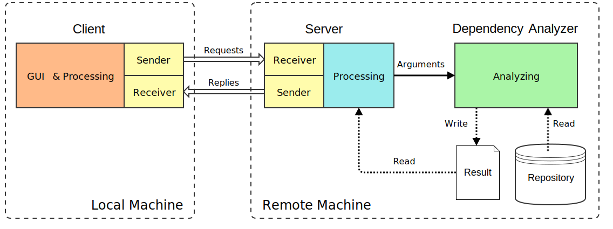
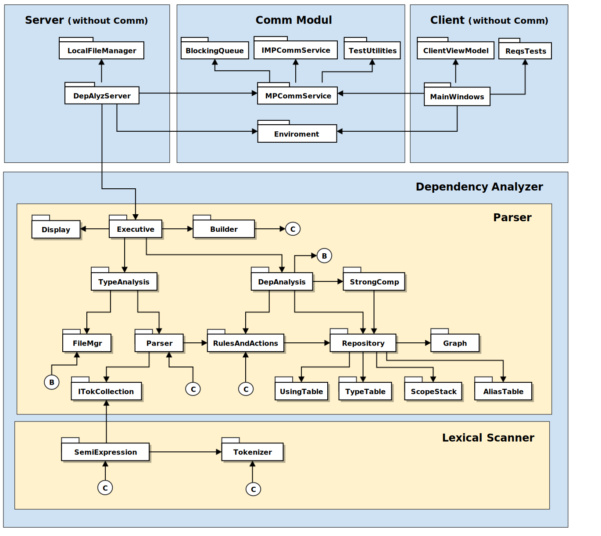
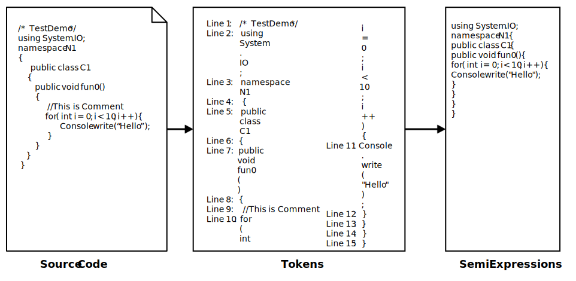
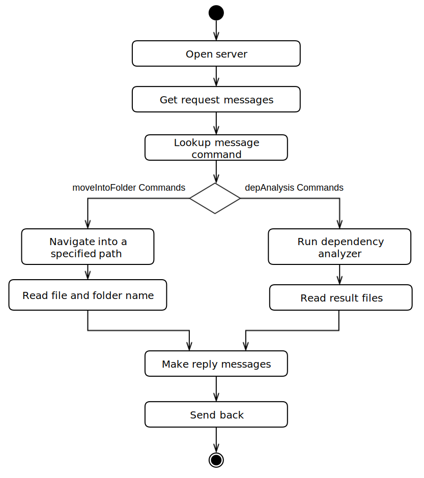
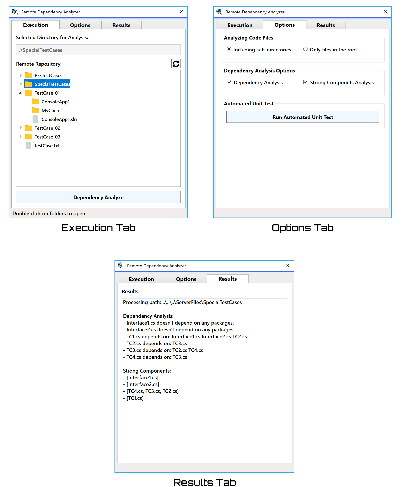

# Remote Package Dependency Analyzer
## About this Work
This work is the final project of the course [CSE681 Software Modeling & Analysis](https://ecs.syr.edu/faculty/fawcett/handouts/webpages/CSE681.htm) (2018 Fall). The instructor of this course is [Prof. Jim Fawcett](https://ecs.syr.edu/faculty/fawcett/handouts/Webpages/fawcettHome.htm) who is a great professor. In this course, there are four related projects in total. And the final project combines all of these projects as a whole.

## Introduction
**Remote Package Dependency Analyzer** is an automated tool to analyze dependency and find strong components among source packages which are stored on the remote server. Figrue 1 below is the overview diagram of this software.

 Figure 1: Overview Conceptual Diagram

It consists of three main parts: **Client**, **Server** and **Dependency Analyzer**. 

* **Client**, which has a GUI residing on users' local machines, is responsible for sending requests messages, receiving reply messages from the server, navigating files on the server and displaying results from the server. 
* **Server** residing on a remote machine provides the capability for replying the requests for navigation from the client, calling Dependency Analyzer for analyzing and replying results to the client. 
* **Dependency Analyzer** is used for analyzing packages in the specified path. It is able to find all dependencies and strong components among packages.

This program is implemented in C# with .Net framework 4.6. The client is built based on Windows Presentation Foundation (WPF). The server is hosted by the console and is in communication with Client using the Windows Communication Foundation Framework (WCF).

## Design
The software's structure is shown in the following modules and packages diagram. There are four main modules which are shown as blue blocks in the diagram: Server(without Comm), Client(without Comm), Comm Module, and Dependency Analyzer. 

Both of Server and Client integrate Comm module, so that they are able to send and receive messages from each other. In the diagram, Comm module is split into a separate module from Server and Client just for simplification. 

 Figure 2: Moduls and Packages Diagram

### 1. Dependency Analyzer
Dependency Analyzer consists of two parts: **Lexical Scanner** and **Parser**. 

#### Lexical Scanner
Lexical Scanner is used for analyzing a stream of source code into a sequence of token collections. Figure 3 below shows its work process. There are two main parts: **Tokenizer** and **SemiExpression**:
 
* **Tokenizer** divides source code into a series of tokens. Token boundaries are white-space characters, transitions between alphanumeric and punctuator characters, and comment and string boundaries. Tokenizer collects quoted strings and comments as single tokens.
* **SemiExpression** groups tokens into grammatical sequences which can be used for subsequent code analyses. SemiExpressions are determined by special terminating characters: semicolon, open brace, closed brace.

 Figure 3: Work Process of Lexical Scanner

In Tokenizer, in order to extract various types of tokens, **State Pattern** is implemented, which allows Tokenizer to alter its tokenization behavior when the current token state changes. Abstract class TokenState has nine subclasses representing nine states each of which has a method `getTok()` to extract their own type of tokens. When the current state ends, it can convert to the next state corresponding to the next characters. The state of Tokenizer is shown in the following diagram Figure 4.

 Figure 4: State Diagram of Tokenizer

Another critical issue is that Tokenizer is required to have the ability to peek at least two characters deep from source code without removing any of them. However, .Net does not support more than one-character deep peek. In order to solve this problem, charQ, a character queue, is constructed. we read as many characters we need out of the stream, but then enqueue them, so they stay in the memory. We can get them later. 

#### Parser
Parser uses Lexical Scanner to collect token sequences for analysis. Parser is a rule-based design. It contains a collection of rules that implement IRule interface. Each rule has a collection of actions that implement IAction interface. By combining various rules in some order, we can build a parser for some specific analysis.

When analyzing source code, the parser just gets the current token sequence and then feeds it to each rule in its rule container. If the condition of the rule is satisfied, rule's actions will be invoked. Each action has access to the data repository to store and retrieve information to execute its task. 

With this rule-based design, we can easily build new parsing applications by only adding new rules and actions, and modifying the combination of them.

ITokenCollection interface is used to decouple Parser and Lexical Scanner so that we can modify Parser to analyze other languages by only changing different Lexical Scanners.

For this application, there are two kinds of parsers: **TypeAnalysis** and **DepAnalysis**. 

* **TypeAnalysis** is a parser to find all the types defined in each of a collection of C# source files and store related information in the repository. It can detect all type definitions including classes, interface, delegate, structs, enums. It can handle aliases as well. Type information will be stored in Type Table and other related information will be stored in Using Table, Scope Stack, and Alias Table. 
* **DepAnalysis** is responsible for finding all dependency files for each file in a specified collection. File A depends on file B, if and only if file A uses any type defined in file B. For example initializing an instance, calling a static method, inheriting a class and implement an interface, etc. DepAnalysis reads through the target source file to check if each possible type token is in the Using Table and Type Table. If it is and this type is defined in another file, then this dependency is found and will be recorded in the graph structure in which nodes are files and edges are dependency relations. If the possible type token is in the Alias Table, the original type name should be used for checking. Table 1 and Table 2 show an example of Type Table and Alias Table.

|Category         |            Name       |        Namespaces     |    File Name   |
|-----------------|-----------------------|-----------------------|----------------|
|interface        |              I1       |             [N4]      |  Interface1.cs |
|interface        |              I2       |             [N5]      |  Interface2.cs |
|   class         |              C1       |             [N1]      |        TC1.cs  |
|   class         |              C1       |             [N2]      |        TC3.cs  |
|    enum         |        WeekDays       |             [N1]      |        TC1.cs  |
|  delegate       |   PerformCalculation  |             [N1]      |        TC1.cs  |
|   class         |              C3       |             [N2]      |         TC2.cs |
|   class         |              C2       |        [N2 : N3]      |         TC2.cs |
|   class         |              C4       |             [N2]      |         TC3.cs |
|  class          |              C5       |        [N2 : C4]      |         TC3.cs |
|  struct         |          Office       |             [N2]      |        TC3.cs  |
|  class          |              C6       |             [N4]      |         TC4.cs |
     
Table 1: Example of Type Table for files in the directory [./ServerFiles/SpecialTestCases/](https://github.com/renyilin/Remote-Package-Dependency-Analyzer/tree/master/ServerFiles/SpecialTestCases)

|  Alias Name       |        Original Name    |     File Name  |
|-------------------|-------------------------|----------------|
|         A1        |            N2.N3        |      TC1.cs    |
|         A2        |            N4.C6        |      TC3.cs    |

Table 2: Example of Alias Table for files in the directory [./ServerFiles/SpecialTestCases/](https://github.com/renyilin/Remote-Package-Dependency-Analyzer/tree/master/ServerFiles/SpecialTestCases)

After the dependency graph built, **StrongComp** implements Tarjan Algorithm to find the largest set of files that are mutually dependent.

### 2. Client & Server

Client and Server both have a communication module Comm which implements asynchronous message passing communication using the Windows Communication Foundation Framework (WCF). Comm is composed of a sender and a receiver. Each receiver has a thread-safe blocking queue for receiving messages from all senders to that endpoint. Senders send messages without waiting for replies. The service object, that receiver instantiates, just enqueues coming messages, and then receiver dequeues messages for processing.  

The client sends a request message to the server. the server processes the message and then sends back an appropriate reply message.

A message contains message type, From and To addresses, Command string, and a list of strings that hold all arguments will suffice all needed operations. With this message structure, we can satisfy all the requirements we need.
 
We use a message dispatcher to handle messages, which can be implemented with a `Dictionary<Msg.command, Action<Msg>>`. `Msg.command` defines the type of processing for a message, and the Action<Msg> defines a specified processing method for that message. When the receiver in Comm module receives a message, the message dispatcher will check the command of this message, and then execute the corresponding action.

Server provides the capability for calling Dependency Analyzer for analyzing a specified directory and replying results to the client. The repository of source code resides on the Server. So Server needs to reply the navigation requests from Client as well. The following figure Figure 5 is the activity diagram of Server.

 Figure 5: State Diagram of Tokenizer

Client is responsible for sending request messages, receiving reply messages from Server, navigating files on Server and displaying results from Server. Figure 6 below is screenshots of the Client GUI. 

 Figure 6: Client GUI

## Source Code
This program is written in C# with .Net framework 4.6 using Visual Studio 2017. Here is the [source code](https://github.com/renyilin/Remote-Package-Dependency-Analyzer).

Please run Visual Studio as Administrator. Set `DepAlyzServer` and `ClientGUI` as startup projects. Then rebuild the solution and start. 

You can also run the program using Developer Command Prompt. First, open Developer Command Prompt as Administrator. Then run `compile.bat` and `run.bat`.

## Reference
* [1] Jim Fawcett. [Project #2 - Lexical Scanner, Using State-Based Tokenizer.](https://ecs.syr.edu/faculty/fawcett/handouts/CSE681/Lectures/Project2-F2018.htm) 
* [2] Jim Fawcett. [Project #3 - Type-Based Package Dependency Analysis](https://ecs.syr.edu/faculty/fawcett/handouts/CSE681/Lectures/Project3-F2018.htm) 
* [3] Jim Fawcett. [Project #4 - Remote Package Dependency Analysis](https://ecs.syr.edu/faculty/fawcett/handouts/CSE681/Lectures/Project4-F2018.htm) 
* [4] Jim Fawcett. [Code Artistry - Source Code Parsing](https://ecs.syr.edu/faculty/fawcett/handouts/webpages/BlogParser.htm)
* [5] Jim Fawcett. [Code Artistry - Message-Passing Communication with Queues](https://ecs.syr.edu/faculty/fawcett/handouts/webpages/BlogMessagePassingComm.htm)

